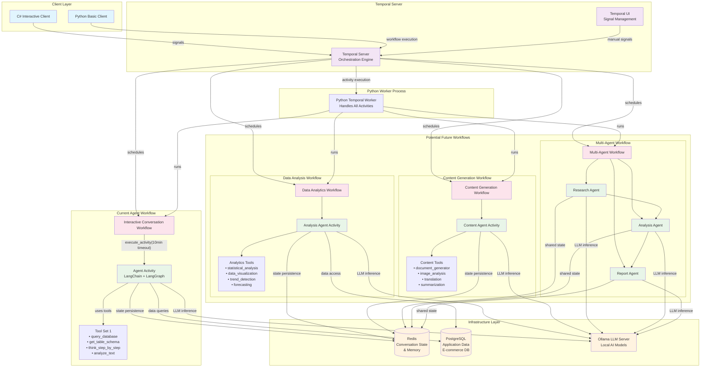
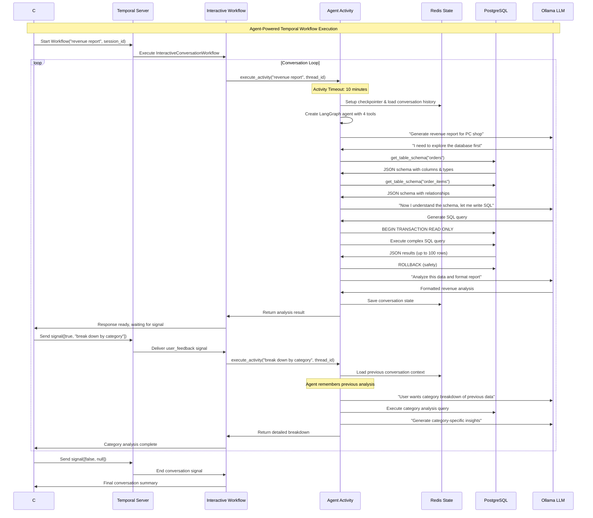
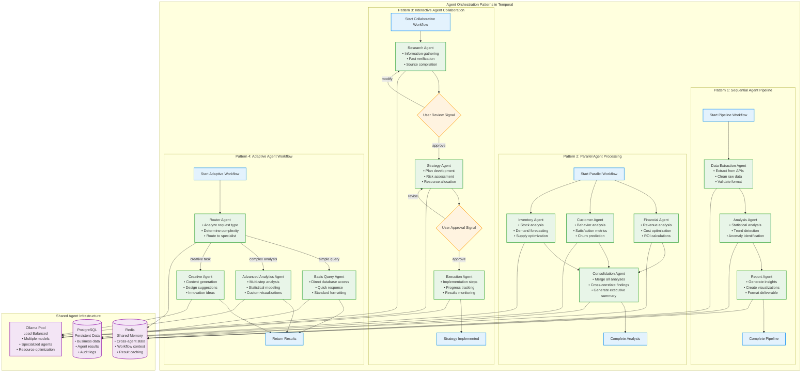

```mermaid
graph TB
    subgraph "Client Layer"
        CS[C# Interactive Client]
        PY[Python Basic Client]
    end
    
    subgraph "Temporal Server"
        TS[Temporal Server<br/>Orchestration Engine]
        TUI[Temporal UI<br/>Signal Management]
    end
    
    subgraph "Current Agent Workflow"
        direction TB
        ICW[Interactive Conversation Workflow]
        ICW --> |"execute_activity(10min timeout)"| AG1[Agent Activity<br/>LangChain + LangGraph]
        AG1 --> |"uses tools"| TOOLS1[Tool Set 1<br/>• query_database<br/>• get_table_schema<br/>• think_step_by_step<br/>• analyze_text]
    end
    
    subgraph "Potential Future Workflows"
        direction TB
        subgraph "Data Analysis Workflow"
            DAW[Data Analytics Workflow]
            DAW --> AGA[Analysis Agent Activity]
            AGA --> TOOLSA[Analytics Tools<br/>• statistical_analysis<br/>• data_visualization<br/>• trend_detection<br/>• forecasting]
        end
        
        subgraph "Content Generation Workflow"
            CGW[Content Generation Workflow]
            CGW --> AGC[Content Agent Activity]
            AGC --> TOOLSC[Content Tools<br/>• document_generator<br/>• image_analysis<br/>• translation<br/>• summarization]
        end
        
        subgraph "Multi-Agent Workflow"
            MAW[Multi-Agent Workflow]
            MAW --> AG2[Research Agent]
            MAW --> AG3[Analysis Agent]
            MAW --> AG4[Report Agent]
            AG2 --> AG3
            AG3 --> AG4
        end
    end
    
    subgraph "Infrastructure Layer"
        direction LR
        REDIS[(Redis<br/>Conversation State<br/>& Memory)]
        PG[(PostgreSQL<br/>Application Data<br/>E-commerce DB)]
        OLLAMA[Ollama LLM Server<br/>Local AI Models]
    end
    
    subgraph "Python Worker Process"
        PW[Python Temporal Worker<br/>Handles All Activities]
    end
    
    %% Client connections
    CS --> |signals| TS
    PY --> |workflow execution| TS
    TUI --> |manual signals| TS
    
    %% Temporal orchestration
    TS --> |schedules| ICW
    TS --> |schedules| DAW
    TS --> |schedules| CGW
    TS --> |schedules| MAW
    
    %% Worker execution
    TS --> |activity execution| PW
    PW --> |runs| ICW
    PW --> |runs| DAW
    PW --> |runs| CGW
    PW --> |runs| MAW
    
    %% Agent infrastructure
    AG1 --> |state persistence| REDIS
    AG1 --> |data queries| PG
    AG1 --> |LLM inference| OLLAMA
    
    AGA --> |state persistence| REDIS
    AGA --> |data access| PG
    AGA --> |LLM inference| OLLAMA
    
    AGC --> |state persistence| REDIS
    AGC --> |LLM inference| OLLAMA
    
    AG2 --> |shared state| REDIS
    AG3 --> |shared state| REDIS
    AG4 --> |shared state| REDIS
    AG2 --> |LLM inference| OLLAMA
    AG3 --> |LLM inference| OLLAMA
    AG4 --> |LLM inference| OLLAMA
    
    %% Styling
    classDef client fill:#e1f5fe
    classDef temporal fill:#f3e5f5
    classDef agent fill:#e8f5e8
    classDef infra fill:#fff3e0
    classDef workflow fill:#fce4ec
    
    class CS,PY client
    class TS,TUI temporal
    class AG1,AGA,AGC,AG2,AG3,AG4 agent
    class REDIS,PG,OLLAMA infra
    class ICW,DAW,CGW,MAW workflow
```

```mermaid
sequenceDiagram
    participant Client as C# Client
    participant Temporal as Temporal Server
    participant Workflow as Interactive Workflow
    participant Agent as Agent Activity
    participant Redis as Redis State
    participant DB as PostgreSQL
    participant Ollama as Ollama LLM
    
    Note over Client,Ollama: Agent-Powered Temporal Workflow Execution
    
    Client->>Temporal: Start Workflow("revenue report", session_id)
    Temporal->>Workflow: Execute InteractiveConversationWorkflow
    
    loop Conversation Loop
        Workflow->>Agent: execute_activity("revenue report", thread_id)
        Note over Agent: Activity Timeout: 10 minutes
        
        Agent->>Redis: Setup checkpointer & load conversation history
        Agent->>Agent: Create LangGraph agent with 4 tools
        
        Agent->>Ollama: "Generate revenue report for PC shop"
        Ollama->>Agent: "I need to explore the database first"
        
        Agent->>DB: get_table_schema("orders")
        DB->>Agent: JSON schema with columns & types
        
        Agent->>DB: get_table_schema("order_items") 
        DB->>Agent: JSON schema with relationships
        
        Agent->>Ollama: "Now I understand the schema, let me write SQL"
        Ollama->>Agent: Generate SQL query
        
        Agent->>DB: BEGIN TRANSACTION READ ONLY
        Agent->>DB: Execute complex SQL query
        DB->>Agent: JSON results (up to 100 rows)
        Agent->>DB: ROLLBACK (safety)
        
        Agent->>Ollama: "Analyze this data and format report"
        Ollama->>Agent: Formatted revenue analysis
        
        Agent->>Redis: Save conversation state
        Agent->>Workflow: Return analysis result
        
        Workflow->>Client: Response ready, waiting for signal
        
        Client->>Temporal: Send signal([true, "break down by category"])
        Temporal->>Workflow: Deliver user_feedback signal
        
        Workflow->>Agent: execute_activity("break down by category", thread_id)
        Agent->>Redis: Load previous conversation context
        Note over Agent: Agent remembers previous analysis
        
        Agent->>Ollama: "User wants category breakdown of previous data"
        Agent->>DB: Execute category analysis query
        Agent->>Ollama: "Generate category-specific insights"
        Agent->>Workflow: Return detailed breakdown
        
        Workflow->>Client: Category analysis complete
    end
    
    Client->>Temporal: Send signal([false, null])
    Temporal->>Workflow: End conversation signal
    Workflow->>Client: Final conversation summary
```

```mermaid
graph TD
    subgraph "Agent Orchestration Patterns in Temporal"
        
        subgraph "Pattern 1: Sequential Agent Pipeline"
            P1_START[Start Pipeline Workflow]
            P1_START --> P1_A1[Data Extraction Agent<br/>• Extract from APIs<br/>• Clean raw data<br/>• Validate format]
            P1_A1 --> P1_A2[Analysis Agent<br/>• Statistical analysis<br/>• Trend detection<br/>• Anomaly identification]
            P1_A2 --> P1_A3[Report Agent<br/>• Generate insights<br/>• Create visualizations<br/>• Format deliverable]
            P1_A3 --> P1_END[Complete Pipeline]
        end
        
        subgraph "Pattern 2: Parallel Agent Processing"
            P2_START[Start Parallel Workflow]
            P2_START --> P2_A1[Financial Agent<br/>• Revenue analysis<br/>• Cost optimization<br/>• ROI calculations]
            P2_START --> P2_A2[Customer Agent<br/>• Behavior analysis<br/>• Satisfaction metrics<br/>• Churn prediction]
            P2_START --> P2_A3[Inventory Agent<br/>• Stock analysis<br/>• Demand forecasting<br/>• Supply optimization]
            P2_A1 --> P2_MERGE[Consolidation Agent<br/>• Merge all analyses<br/>• Cross-correlate findings<br/>• Generate executive summary]
            P2_A2 --> P2_MERGE
            P2_A3 --> P2_MERGE
            P2_MERGE --> P2_END[Complete Analysis]
        end
        
        subgraph "Pattern 3: Interactive Agent Collaboration"
            P3_START[Start Collaborative Workflow]
            P3_START --> P3_A1[Research Agent<br/>• Information gathering<br/>• Fact verification<br/>• Source compilation]
            P3_A1 --> P3_SIGNAL{User Review Signal}
            P3_SIGNAL -->|approve| P3_A2[Strategy Agent<br/>• Plan development<br/>• Risk assessment<br/>• Resource allocation]
            P3_SIGNAL -->|modify| P3_A1
            P3_A2 --> P3_SIGNAL2{User Approval Signal}
            P3_SIGNAL2 -->|approve| P3_A3[Execution Agent<br/>• Implementation steps<br/>• Progress tracking<br/>• Results monitoring]
            P3_SIGNAL2 -->|revise| P3_A2
            P3_A3 --> P3_END[Strategy Implemented]
        end
        
        subgraph "Pattern 4: Adaptive Agent Workflow"
            P4_START[Start Adaptive Workflow]
            P4_START --> P4_ROUTER[Router Agent<br/>• Analyze request type<br/>• Determine complexity<br/>• Route to specialist]
            P4_ROUTER -->|simple query| P4_SIMPLE[Basic Query Agent<br/>• Direct database access<br/>• Quick response<br/>• Standard formatting]
            P4_ROUTER -->|complex analysis| P4_COMPLEX[Advanced Analytics Agent<br/>• Multi-step analysis<br/>• Statistical modeling<br/>• Custom visualizations]
            P4_ROUTER -->|creative task| P4_CREATIVE[Creative Agent<br/>• Content generation<br/>• Design suggestions<br/>• Innovation ideas]
            P4_SIMPLE --> P4_END[Return Results]
            P4_COMPLEX --> P4_END
            P4_CREATIVE --> P4_END
        end
    end
    
    subgraph "Shared Agent Infrastructure"
        REDIS_SHARED[(Redis<br/>Shared Memory<br/>• Cross-agent state<br/>• Workflow context<br/>• Result caching)]
        DB_SHARED[(PostgreSQL<br/>Persistent Data<br/>• Business data<br/>• Agent results<br/>• Audit logs)]
        LLM_SHARED[Ollama Pool<br/>Load Balanced<br/>• Multiple models<br/>• Specialized agents<br/>• Resource optimization]
    end
    
    %% Connections to shared infrastructure
    P1_A1 --> REDIS_SHARED
    P1_A2 --> REDIS_SHARED
    P1_A3 --> REDIS_SHARED
    
    P2_A1 --> DB_SHARED
    P2_A2 --> DB_SHARED
    P2_A3 --> DB_SHARED
    P2_MERGE --> REDIS_SHARED
    
    P3_A1 --> LLM_SHARED
    P3_A2 --> LLM_SHARED
    P3_A3 --> LLM_SHARED
    
    P4_ROUTER --> REDIS_SHARED
    P4_SIMPLE --> DB_SHARED
    P4_COMPLEX --> LLM_SHARED
    P4_CREATIVE --> LLM_SHARED
    
    %% Styling
    classDef agent fill:#e8f5e8,stroke:#4caf50,stroke-width:2px
    classDef workflow fill:#e3f2fd,stroke:#2196f3,stroke-width:2px
    classDef signal fill:#fff3e0,stroke:#ff9800,stroke-width:2px
    classDef infra fill:#f3e5f5,stroke:#9c27b0,stroke-width:2px
    
    class P1_A1,P1_A2,P1_A3,P2_A1,P2_A2,P2_A3,P2_MERGE,P3_A1,P3_A2,P3_A3,P4_ROUTER,P4_SIMPLE,P4_COMPLEX,P4_CREATIVE agent
    class P1_START,P1_END,P2_START,P2_END,P3_START,P3_END,P4_START,P4_END workflow
    class P3_SIGNAL,P3_SIGNAL2 signal
    class REDIS_SHARED,DB_SHARED,LLM_SHARED infra
```