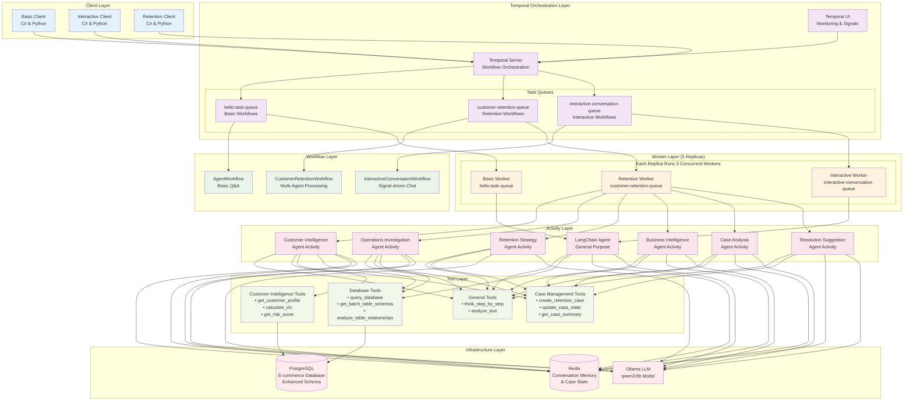
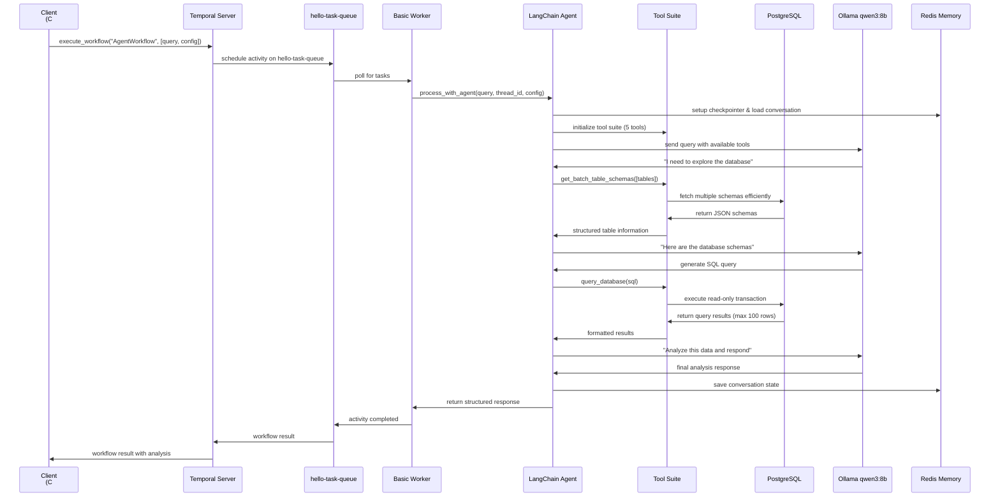
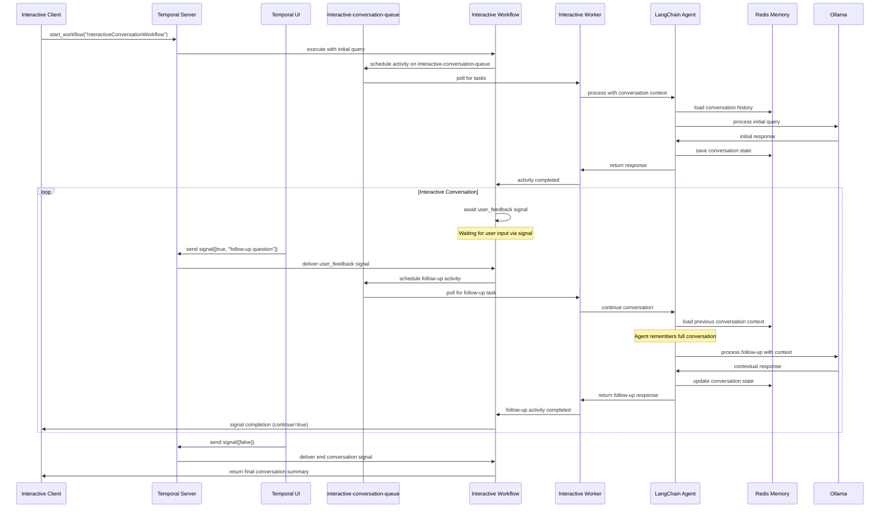

# Distributed LangGraph Agent As A Temporal Workflow

This repository demonstrates how to set up a distributed LangGraph ReAct agent utilizing Redis for conversational memory management and Temporal for durable execution of agentic workflows.

## Demo

[](https://youtu.be/DDVs6I3xeNo)

*Click the image above to watch the demo video*


## Quick Start

1. Start the platform services
```bash
docker compose --profile temporal up --build -d
```

2. Start the worker(s) - expand for additional workers
```bash
docker compose up --build -d python-worker
```

3. Start the workflow
```bash
docker compose up --build -d csharp-client
```

## Usage

To chat with the agent, send a signal via the Temporal [UI](http://localhost:8080)
```json
[true, "Why should I use Temporal for durable workflow execution?"]
```

To complete the workflow
```json
[false]
```

## Architecture Diagrams

### 1. Overall System Architecture



### 2. Basic Workflow Execution



### 3. Interactive Conversation Workflow



### 4. Customer Retention Multi-Agent Workflow

```mermaid
graph TB
    subgraph "Customer Retention Workflow - customer-retention-queue"
        START[Customer Complaint<br/>+ Order IDs + Priority]
        
        STAGE1[Stage 1: Case ID Generation<br/>retention_customerID_timestamp]
        
        subgraph "Stage 2: Parallel Intelligence Gathering"
            direction TB
            CIA[Customer Intelligence Agent<br/>Worker 1<br/>• Customer profile & CLV<br/>• Risk assessment<br/>• Retention priority<br/>• Case initialization]
            OIA[Operations Investigation Agent<br/>Worker 2<br/>• Order investigation<br/>• Root cause analysis<br/>• Systemic issues<br/>• Timeline reconstruction]
        end
        
        STAGE3[Stage 3: Strategy Development<br/>Worker 3<br/>Retention Strategy Agent<br/>• Analyze intelligence data<br/>• Develop retention plan<br/>• Calculate compensation<br/>• ROI justification]
        
        subgraph "Stage 4-5: Parallel Analysis & Reporting"
            direction TB
            BIA[Business Intelligence Agent<br/>Worker 4<br/>• Executive reporting<br/>• Strategic insights<br/>• Policy recommendations<br/>• Process improvements]
            CAA[Case Analysis Agent<br/>Worker 5<br/>• Extract REAL metrics<br/>• CLV validation<br/>• Retention probability<br/>• Success assessment]
        end
        
        subgraph "Stage 6: Resolution & Human Approval"
            RES[Resolution Suggestion Agent<br/>Worker 6<br/>• Synthesize all case data<br/>• Create actionable resolution<br/>• Human-in-the-loop approval]
            APPROVAL{Human Approval<br/>via Temporal Signal<br/>approve_resolution}
            RETRY[Generate New Resolution<br/>Based on Feedback]
        end
        
        FINAL[Stage 7: Results Compilation<br/>• Customer Retained: True/False<br/>• Actual CLV: $X,XXX<br/>• ROI Analysis: X.XX<br/>• Executive Summary<br/>• Resolution Attempts: N]
    end
    
    subgraph "Distributed State Management"
        REDIS[Redis Shared State<br/>• Case metadata & context<br/>• Cross-agent coordination<br/>• Real-time progress tracking]
        POSTGRES[Enhanced PostgreSQL Schema<br/>• Customer intelligence data<br/>• Support tickets & preferences<br/>• Financial & delivery tracking]
    end
    
    subgraph "Specialized Tool Distribution"
        CITOOLS[Customer Intelligence Tools<br/>• get_customer_profile<br/>• calculate_clv<br/>• get_risk_score]
        DBTOOLS[Database Investigation Tools<br/>• query_database<br/>• get_batch_schemas<br/>• analyze_relationships]
        CMTOOLS[Case Management Tools<br/>• create_retention_case<br/>• update_case_state<br/>• get_case_summary]
    end
    
    subgraph "Human Interaction"
        UI[Temporal UI<br/>Manual Signal Sending]
        SIGNALS[Signal Examples:<br/>{"approve": true, "followUp": ""}<br/>{"approve": false, "followUp": "..."}]
    end
    
    %% Flow connections
    START --> STAGE1
    STAGE1 --> CIA
    STAGE1 --> OIA
    CIA --> STAGE3
    OIA --> STAGE3
    STAGE3 --> BIA
    STAGE3 --> CAA
    BIA --> RES
    CAA --> RES
    RES --> APPROVAL
    APPROVAL -->|Approved| FINAL
    APPROVAL -->|Declined| RETRY
    RETRY --> RES
    
    %% Human interaction
    UI --> APPROVAL
    SIGNALS --> UI
    
    %% State management
    CIA -.-> REDIS
    OIA -.-> REDIS
    STAGE3 -.-> REDIS
    BIA -.-> REDIS
    CAA -.-> REDIS
    RES -.-> REDIS
    
    %% Data access
    CIA --> POSTGRES
    OIA --> POSTGRES
    CIA --> CITOOLS
    OIA --> DBTOOLS
    STAGE3 --> CMTOOLS
    BIA --> CMTOOLS
    CAA --> CMTOOLS
    RES --> CMTOOLS
    
    %% Parallel execution indicators
    CIA -.->|"asyncio.gather()"| OIA
    BIA -.->|"asyncio.gather()"| CAA
    
    %% Styling
    classDef parallel fill:#e8f5e8,stroke:#4caf50,stroke-width:3px
    classDef sequential fill:#e3f2fd,stroke:#2196f3,stroke-width:2px
    classDef human fill:#fff3e0,stroke:#ff9800,stroke-width:3px
    classDef state fill:#f3e5f5,stroke:#9c27b0,stroke-width:2px
    classDef tools fill:#f1f8e9,stroke:#8bc34a,stroke-width:2px
    
    class CIA,OIA,BIA,CAA parallel
    class START,STAGE1,STAGE3,RES,FINAL sequential
    class APPROVAL,RETRY,UI,SIGNALS human
    class REDIS,POSTGRES state
    class CITOOLS,DBTOOLS,CMTOOLS tools
```