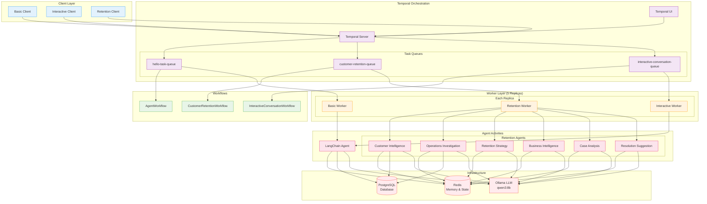
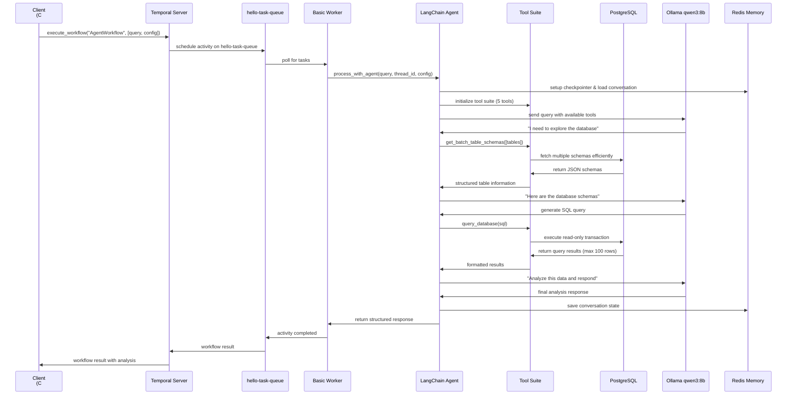
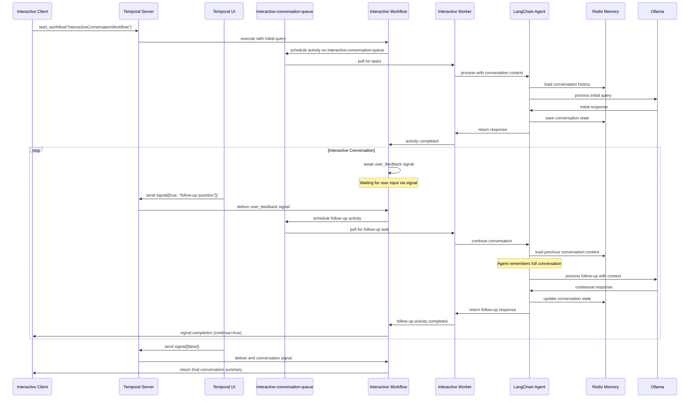
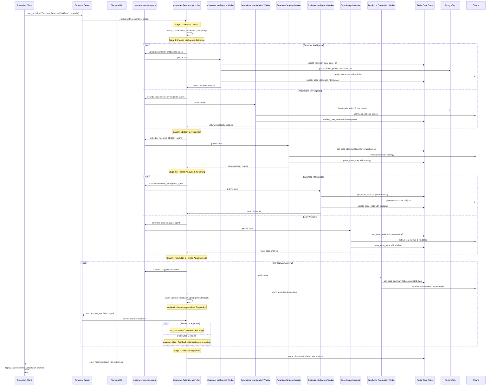

# Distributed LangGraph Agent As A Temporal Workflow

This repository demonstrates how to set up a distributed LangGraph ReAct agent utilizing Redis for conversational memory management and Temporal for durable execution of agentic workflows.

## Demo

[](https://youtu.be/DDVs6I3xeNo)

*Click the image above to watch the demo video*


## Quick Start

1. Start the platform services
```bash
docker compose --profile temporal up --build -d
```

2. Start the worker(s) - expand for additional workers
```bash
docker compose up --build -d python-worker
```

3. Start the workflow
```bash
docker compose up --build -d csharp-client
```

## Usage

To chat with the agent, send a signal via the Temporal [UI](http://localhost:8080)
```json
[true, "Why should I use Temporal for durable workflow execution?"]
```

To complete the workflow
```json
[false]
```

## Architecture Diagrams

### 1. Overall System Architecture



### 2. Basic Workflow Execution



### 3. Interactive Conversation Workflow



### 4. Customer Retention Multi-Agent Workflow



**Human Approval Signal Examples:**
```json
// Approve resolution
{"approve": true, "followUp": ""}

// Decline with feedback  
{"approve": false, "followUp": "Please provide more specific timeline commitments and escalation procedures."}
```